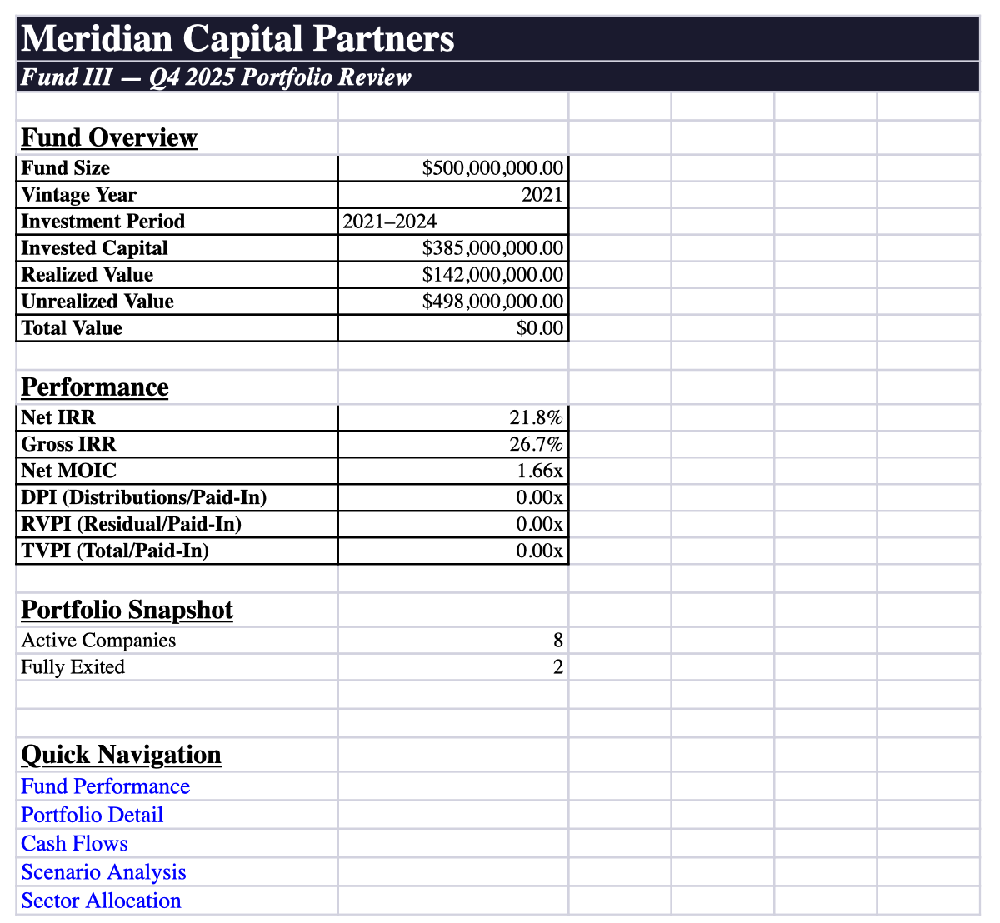

# fcp-sheets

MCP server for semantic spreadsheet operations.

<p align="center">
  
  <br>
  <em>6-sheet PE portfolio review — built by an LLM using fcp-sheets</em>
</p>

## What It Does

fcp-sheets lets LLMs create and edit Excel workbooks by describing spreadsheet intent -- data entry, formulas, styling, charts, conditional formatting -- and renders it into standard `.xlsx` files. Instead of writing openpyxl code cell-by-cell, the LLM works with operations like `data A5` block entry, `style A1:F1 bold fill:#1a1a2e`, and `chart add stacked-column data:B3:C7`. Built on the [FCP](https://github.com/os-tack/fcp) framework, powered by openpyxl for serialization.

## Quick Example

```
sheets_session('new "Q4 Report" sheets:"Summary,Details"')

sheets([
    'data A1',
    '| Region | Q4 Revenue | Q4 Costs | Margin |',
    '| North | 1250000 | 875000 | =C2/B2 |',
    '| South | 980000 | 710000 | =C3/B3 |',
    '| East | 1100000 | 790000 | =C4/B4 |',
    '| West | 870000 | 620000 | =C5/B5 |',
    'data end',
    'style A1:D1 bold fill:#2F5496 color:#FFFFFF',
    'style B2:C5 fmt:$#,##0',
    'style D2:D5 fmt:0.0%',
    'chart add clustered-column title:"Q4 Revenue by Region" data:B1:C5 categories:A2:A5',
])

sheets_session('save as:./q4_report.xlsx')
```

### Available MCP Tools

| Tool | Purpose |
|------|---------|
| `sheets(ops)` | Batch mutations -- data entry, formulas, styling, charts, merges, borders |
| `sheets_query(q)` | Inspect the workbook -- list sheets, describe ranges, read values, find |
| `sheets_session(action)` | Lifecycle -- new, open, save, checkpoint, undo, redo |
| `sheets_help()` | Full reference card |

### Benchmark

In a head-to-head against raw openpyxl on a 6-sheet PE portfolio workbook (84 audit checks):

| Metric | FCP | Raw openpyxl | Delta |
|---|---|---|---|
| **Audit Score** | 84/84 (100%) | 84/84 (100%) | Tie |
| **Total Time** | 559s (9.3 min) | 1,360s (22.7 min) | FCP 2.4x faster |
| **Total Cost** | $3.37 | $4.11 | FCP 18% cheaper |
| **Output Tokens** | 29,065 | 101,909 | FCP 3.5x fewer |

See [`docs/benchmark/`](docs/benchmark/) for the full writeup, audit script, and output files.

## Installation

Requires Python >= 3.11.

```bash
pip install fcp-sheets
```

### MCP Client Configuration

```json
{
  "mcpServers": {
    "sheets": {
      "command": "uv",
      "args": ["run", "python", "-m", "fcp_sheets"]
    }
  }
}
```

## Architecture

3-layer architecture:

```
MCP Server (Intent Layer)
  Parses op strings, dispatches to verb handlers
        |
Semantic Model
  Thin wrapper around openpyxl Workbook
  Cell ref parser, sheet index, block mode, undo/redo via byte snapshots
        |
Serialization (openpyxl)
  Semantic model -> .xlsx binary output
```

Key features:

- **Block data entry** -- `data`/`data end` blocks enter tabular data with markdown table syntax
- **Formulas** -- Including cross-sheet references (`='Sheet 2'!B5`)
- **Styling** -- Font, fill, borders, number formats, merges, alignment
- **Charts** -- Bar, line, pie, scatter, bubble, area, doughnut, stacked variants
- **Conditional formatting** -- Cell-is rules, color scales, data bars
- **Named ranges & validation** -- Drop-down lists, range names
- **Page setup** -- Orientation, print titles, frozen panes, filters
- **Undo/redo** -- Full workbook snapshots with event sourcing

## Development

```bash
uv sync
uv run pytest       # 616 tests
uv run ruff check   # linting
uv run pyright      # type checking
```

## License

MIT
